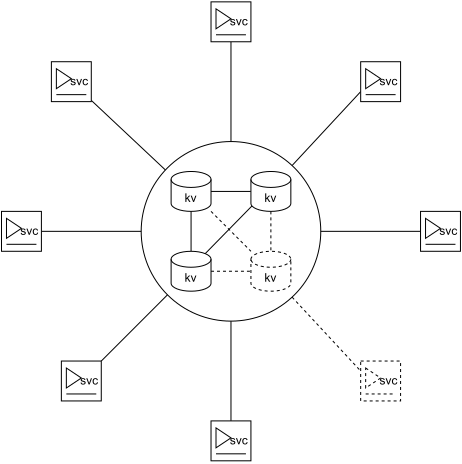

# Description
**RecurrentWorkerService** allows you to execute any payload on a schedule. There are three types of schedules: Recurrent, Cron and based on Workload. The **RecurrentWorkerService** supports etcd persistence for iteration coordination and fault tolerance.

# Schedules
A new iteration will not start until the current one has completed. If iteration failed it can be retried after specified intrval.

## Recurrent
Runs iteration in a certain time interval: once per any *TimeSpan*. The time interval does not depend on the duration of one iteration.

## Сron
Runs according to the crontab schedule.  
For example **0 22 \* \* 1-5** is *At 22:00 on every day-of-week from Monday through Friday*.

## Workload 
The iteration execution time interval is described by a certain time range. The next iteration time depends on how much work has been done in the current iteration. As a general rule, the more work, the shorter the interval. The schedule involves setting the function for calculating the interval time. There are several operations that can be applied to the duration of an interval, depending on the workload. They are: Add, Subtract, Set, Multiply, Divide. Operations are applied to the interval for workload greater than the specified breakpoint. Workload value is byte, and can be presented in percents.  
For example interval in range 00:00:01 to 00:05:00. And workload breakpoints are:
- 0% Add 20 seconds
- 10% Multiply twice 
- 25% Add 10 seconds
- 50% Subtract 30 seconds 
- 80% Divide by 2
- 100% Set 1 second

# Usage

## Installation
```shell
Install-Package RecurrentWorkerService
```

## Payload
Create a class that implements the corresponding schedule interface: IRecurrentWorker, ICronWorker, IWorkloadWorker.

### Cron
```C#
internal class ExampleOfCronWorker : ICronWorker
{
    public async Task ExecuteAsync(CancellationToken cancellationToken)
    {
        await Task.CompletedTask;
    }
}
```

### Recurrent
```C#
internal class ExampleOfRecurrentWorker : IRecurrentWorker
{
    public async Task ExecuteAsync(CancellationToken cancellationToken)
    {
        await Task.CompletedTask;
    }
}
```

### Workload
```C#
internal class ExampleOfWorkloadWorker : IWorkloadWorker
{
    public async Task<Workload> ExecuteAsync(CancellationToken cancellationToken)
    {
        await Task.CompletedTask;
        return Workload.Full;
        // return Workload.Zero;
        // return Workload.FromDoneItems(doneItems: 5, maxItems: 10);
        // return Workload.FromPercent(10);
        // return 255;
    }
}
```

## Registration 

### Direct type registration
```C#
await Host.CreateDefaultBuilder(args)
    .ConfigureServices(services =>
    {
        services.AddWorkers(w =>
        {
            w.AddCronWorker<ExampleOfCronWorker>(s => s
                .SetCronExpression("* * * * *")
                .SetRetryOnFailDelay(TimeSpan.FromSeconds(1)));

            w.AddRecurrentWorker<ExampleOfRecurrentWorker>(s => s
                .SetPeriod(TimeSpan.FromSeconds(1))
                .SetRetryOnFailDelay(TimeSpan.FromMilliseconds(10)));

            w.AddWorkloadWorker<ExampleOfWorkloadWorker>(s => s
                .SetRange(TimeSpan.FromSeconds(1), TimeSpan.FromMinutes(5))
                .SetStrategies(c => c
                    .Add(Workload.Zero, TimeSpan.FromSeconds(30))
                    .Multiply(Workload.FromPercent(10), 2)
                    .Add(Workload.FromPercent(25), TimeSpan.FromSeconds(10))
                    .Subtract(Workload.FromPercent(50), TimeSpan.FromSeconds(30))
                    .Divide(Workload.FromPercent(80), 2d)
                    .Set(Workload.Full, TimeSpan.FromSeconds(1)))
                .SetRetryOnFailDelay(TimeSpan.FromSeconds(1)));
        });
    })
    .Build()
    .RunAsync();
```

### Registration of implementation factories
```C#
await Host.CreateDefaultBuilder(args)
    .ConfigureServices(services =>
    {
        services.AddWorkers(w =>
        {
            w.AddCronWorker(
                c => new ExampleOfCronWorker(c.GetRequiredService<ILogger<ExampleOfCronWorker>>()),
                s => s
                    .SetCronExpression("* * * * *")
                    .SetRetryOnFailDelay(TimeSpan.FromSeconds(1)));

            w.AddRecurrentWorker(
                c => new ExampleOfRecurrentWorker(c.GetRequiredService<ILogger<ExampleOfRecurrentWorker>>()),
                s => s
                    .SetPeriod(TimeSpan.FromSeconds(1))
                    .SetRetryOnFailDelay(TimeSpan.FromMilliseconds(10)));

            w.AddWorkloadWorker(
                c => new ExampleOfWorkloadWorker(c.GetRequiredService<ILogger<ExampleOfWorkloadWorker>>()),
                s => s
                    .SetRange(TimeSpan.FromSeconds(1), TimeSpan.FromMinutes(5))
                    .SetStrategies(c => c
                        .Add(Workload.Zero, TimeSpan.FromSeconds(1))
                        .Set(Workload.Full, TimeSpan.FromSeconds(1)))
                    .SetRetryOnFailDelay(TimeSpan.FromSeconds(1)));
        });
    })
    .Build()
    .RunAsync();
```
### Registration using config sections

#### For cron workers
```JSON
"WorkerSchedules": {
    "ExampleOfSomeCronSchedule": {
        "CronExpression": "* * * * *",
        "RetryOnFailDelay": "00:00:01"
    },
}
```

#### For recurrent workers
```JSON
"WorkerSchedules": {
    "ExampleOfSomeRecurrentSchedule": {
        "Period": "00:00:02",
        "RetryOnFailDelay": "00:00:01"
    },
}
```

#### For workload workers
```JSON
"WorkerSchedules": {
    "ExampleOfSomeWorkloadSchedule": {
        "PeriodFrom": "00:00:01",
        "PeriodTo": "00:05:00",
        "RetryOnFailDelay": "00:00:01"
    },

    "ExampleOfSomeWorkloadScheduleWithStrategies": {
        "PeriodFrom": "00:00:01",
        "PeriodTo": "00:05:00",
        "RetryOnFailDelay": "00:00:01",
        "Strategies": [
            { "Workload": 0, "Action": "Add", "ActionPeriod": "00:00:01" },
            { "Workload": 50, "Action": "Add", "ActionPeriod": "00:00:05" },
            { "Workload": 100, "Action": "Multiply", "ActionCoefficient": 2 },
            { "Workload": 125, "Action": "Subtract", "ActionPeriod": "00:00:05" },
            { "Workload": 200, "Action": "Divide", "ActionCoefficient": 2 },
            { "Workload": 255, "Action": "Set", "ActionPeriod": "00:00:01" }
        ]
    }
}
```

#### Registration
```C#
await Host.CreateDefaultBuilder(args)
    .ConfigureServices((context, services) =>
    {
        services.AddWorkers(w =>
        {
            w.AddCronWorker(
                c => new ExampleOfCronWorker(c.GetRequiredService<ILogger<ExampleOfCronWorker>>()),
                s => s.FromConfigSection(context.Configuration.GetRequiredSection("WorkerSchedules:ExampleOfSomeCronSchedule")));

            w.AddRecurrentWorker(
                c => new ExampleOfRecurrentWorker(c.GetRequiredService<ILogger<ExampleOfRecurrentWorker>>()),
                s => s.FromConfigSection(context.Configuration.GetRequiredSection("WorkerSchedules:ExampleOfSomeRecurrentSchedule")));

            w.AddWorkloadWorker(
                c => new ExampleOfWorkloadWorker(c.GetRequiredService<ILogger<ExampleOfWorkloadWorker>>()),
                s => s.FromConfigSection(context.Configuration.GetRequiredSection("WorkerSchedules:ExampleOfSomeWorkloadSchedule")));

            w.AddWorkloadWorker(
                c => new ExampleOfWorkloadWorker(c.GetRequiredService<ILogger<ExampleOfWorkloadWorker>>()),
                s => s.FromConfigSection(context.Configuration.GetRequiredSection("WorkerSchedules:ExampleOfSomeWorkloadScheduleWithStrategies")));
        });
    })
    .Build()
    .RunAsync();
```

# Distributed

## Specifics
- The nodes of the system are peer-to-peer. No leader selection process for further coordination of iterations. 
- System nodes use etcd for coordination.
- The time on the nodes is synchronized via NTP (Network Time Protocol).

## Restrictions
- Work well if each node has an identical configuration file.
- The minimum iteration period is equal to the sum of the ping to the storage and its replication time.

## Scheme


## Installation
```shell
Install-Package RecurrentWorkerService.Distributed
Install-Package RecurrentWorkerService.Distributed.EtcdPersistence
```

## Registration 
You have to specify the service ID and the ID of the registered worker. According to these identifiers, the service will organize the keys in the storage.
```C#
var factory = new StaticResolverFactory(addr => new[]
{
    new BalancerAddress("192.168.1.74", 23791),
    new BalancerAddress("192.168.1.74", 23792),
    new BalancerAddress("192.168.1.74", 23793),
});

var channel = GrpcChannel.ForAddress(
    "static://",
    new GrpcChannelOptions
    {
        Credentials = ChannelCredentials.Insecure,
        ServiceProvider = new ServiceCollection().AddSingleton<ResolverFactory>(factory).BuildServiceProvider(),
        ServiceConfig = new ServiceConfig
        {
            MethodConfigs =
            {
                new MethodConfig
                {
                    Names = { MethodName.Default },
                    RetryPolicy = new RetryPolicy
                    {
                        MaxAttempts = 5,
                        InitialBackoff = TimeSpan.FromSeconds(1),
                        MaxBackoff = TimeSpan.FromSeconds(5),
                        BackoffMultiplier = 1.5,
                        RetryableStatusCodes = { StatusCode.Unavailable }
                    }
                }
            }
        }
    });


await Host.CreateDefaultBuilder(args)
    .ConfigureServices(services =>
    {
        services.AddDistributedWorkers(
            "LocalWorkerService",
            w =>
            {
                w.AddDistributedCronWorker<ExampleOfCronWorker>(
                    "CronWorker-1",
                    s => s
                        .SetCronExpression("* * * * *")
                        .SetRetryOnFailDelay(TimeSpan.FromSeconds(1)));

                w.AddDistributedCronWorker(
                    "CronWorker-2",
                    c => new ExampleOfCronWorker(c.GetRequiredService<ILogger<ExampleOfCronWorker>>()),
                    s => s
                        .SetCronExpression("* * * * *")
                        .SetRetryOnFailDelay(TimeSpan.FromSeconds(1)));

                w.AddDistributedRecurrentWorker<ExampleOfRecurrentWorker>(
                    "RecurrentWorker-1",
                    s => s
                        .SetPeriod(TimeSpan.FromSeconds(5))
                        .SetRetryOnFailDelay(TimeSpan.Zero));
                
                w.AddDistributedWorkloadWorker<ExampleOfWorkloadWorker>(
                    "WorkloadWorker-1",
                    s => s.SetRange(TimeSpan.FromSeconds(1), TimeSpan.FromSeconds(10))
                        .SetStrategies(c => c.Add(Workload.Zero, TimeSpan.FromSeconds(1))
                        .Subtract(Workload.FromPercent(50), TimeSpan.FromSeconds(1))));
            })
            .AddEtcdPersistence(channel)
            .AddBasicPrioritization();    
    })
    .Build()
    .RunAsync();
```

### Deploy etcd nodes in docker
```Shell
docker network create etcd-cluster
docker run -d --name=etcd1 --network=etcd-cluster -p 23791:2379 quay.io/coreos/etcd /usr/local/bin/etcd -name etcd1 -advertise-client-urls http://0.0.0.0:2379 -listen-client-urls http://0.0.0.0:2379 -initial-advertise-peer-urls http://etcd1:2380 -listen-peer-urls http://0.0.0.0:2380 -initial-cluster-token etcd-cluster-1 -initial-cluster etcd1=http://etcd1:2380,etcd2=http://etcd2:2380,etcd3=http://etcd3:2380 -initial-cluster-state new
docker run -d --name=etcd2 --network=etcd-cluster -p 23792:2379 quay.io/coreos/etcd /usr/local/bin/etcd -name etcd2 -advertise-client-urls http://0.0.0.0:2379 -listen-client-urls http://0.0.0.0:2379 -initial-advertise-peer-urls http://etcd2:2380 -listen-peer-urls http://0.0.0.0:2380 -initial-cluster-token etcd-cluster-1 -initial-cluster etcd1=http://etcd1:2380,etcd2=http://etcd2:2380,etcd3=http://etcd3:2380 -initial-cluster-state new
docker run -d --name=etcd3 --network=etcd-cluster -p 23793:2379 quay.io/coreos/etcd /usr/local/bin/etcd -name etcd3 -advertise-client-urls http://0.0.0.0:2379 -listen-client-urls http://0.0.0.0:2379 -initial-advertise-peer-urls http://etcd3:2380 -listen-peer-urls http://0.0.0.0:2380 -initial-cluster-token etcd-cluster-1 -initial-cluster etcd1=http://etcd1:2380,etcd2=http://etcd2:2380,etcd3=http://etcd3:2380 -initial-cluster-state new
```
